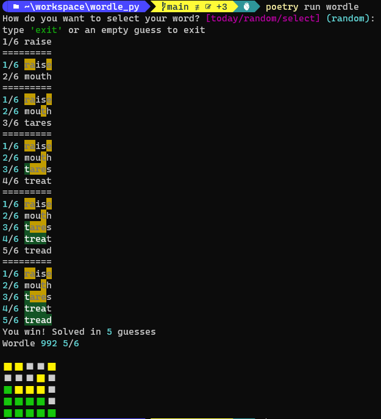

# wordle_py
[Wordle](https://www.powerlanguage.co.uk/wordle/) clone in the command line using [python](python.org) and [rich](https://github.com/Textualize/rich). Created to play around more with rich as well as VSCode devcontainers



## To Install
With `Poetry`
```shell
poetry install
```

Without `Poetry`
```shell
pip3 install --user -r requirements.txt
```

## To Play
```shell
poetry run python main.py
# Or
poetry shell
python main.py
```

## Requirements
- python 3.6+
- fingers (maybe)